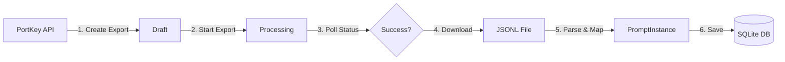

# PortKey Log Ingestion System - Implementation Guide

## Overview

This system automatically pulls prompt logs from PortKey's observability platform and stores them in a local SQLite database for analysis and processing.

---

## Architecture



---

## File Structure

| File | Purpose |
|------|---------|
| `packages/ingestion/portkey.py` | Core `PortKeyIngestor` class with API calls |
| `packages/ingestion/worker.py` | Background worker with scheduling loop |
| `packages/storage/repositories.py` | Database operations via `PromptRepository` |
| `apps/cli/main.py` | CLI commands (`portkey-worker`, `prompts`) |
| `.env` | API key configuration |

---

## Workflow Steps

### Step 1: Create Export (Draft)
```http
POST https://api.portkey.ai/v1/logs/exports
```
Creates a draft export job with filters (time range) and requested fields.

### Step 2: Start Export
```http
POST https://api.portkey.ai/v1/logs/exports/{id}/start
```
Moves the export from `draft` → `in_progress`.

### Step 3: Poll Status
```http
GET https://api.portkey.ai/v1/logs/exports/{id}
```
Polls every 5 seconds until status becomes `success`.

### Step 4: Get Download URL
```http
GET https://api.portkey.ai/v1/logs/exports/{id}/download
```
Returns a pre-signed S3 URL for the JSONL file.

### Step 5: Download & Parse
Downloads the JSONL file and parses each line into a `PromptInstance` object.

### Step 6: Save to Database
Persists each `PromptInstance` to the `prompt_instances` table via `PromptRepository`.

---

## Data Mapping

| PortKey Field | Database Field |
|---------------|----------------|
| `id` | `prompt_id` |
| `request.messages[-1].content` | `original_text` |
| `created_at` | `created_at` |
| `trace_id`, `cost`, `ai_model`, etc. | `metadata_` (JSON) |

---

## Commands

### Start the Ingestion Worker
```cmd
python -m apps.cli.main portkey-worker --interval 10
```
- `--interval`: Minutes between ingestion cycles (default: 10)

### View Ingested Prompts
```cmd
python -m apps.cli.main prompts
```

### View Database (GUI)
Open `data/genome.db` in DB Browser for SQLite.

---

## State Persistence

The worker saves its last run time to `ingestion_state.json`:
```json
{"last_run_time": "2026-01-17T14:08:04.048716"}
```
This ensures only new logs are fetched on subsequent runs.

---
```
